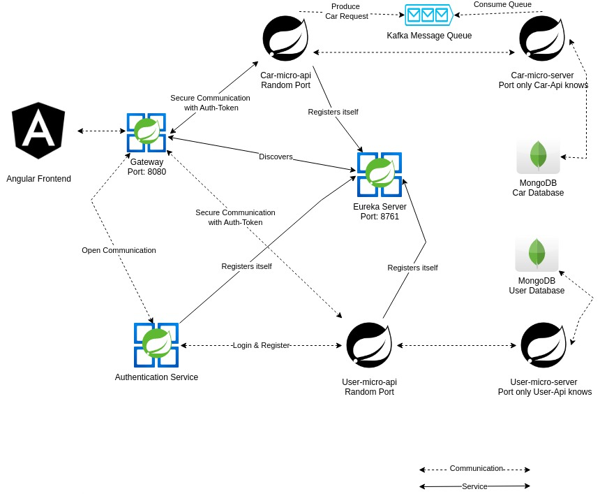
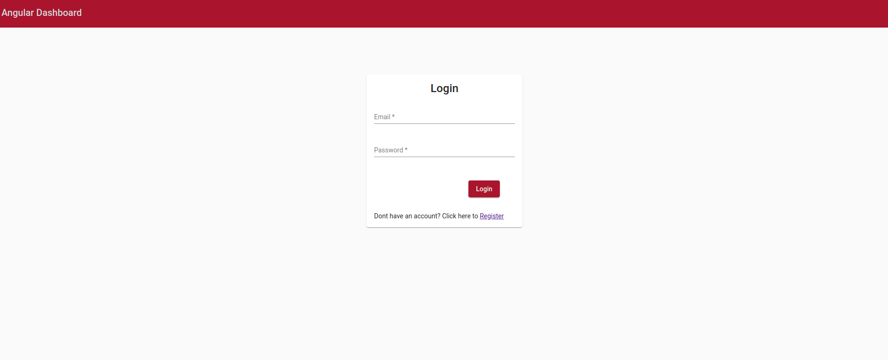
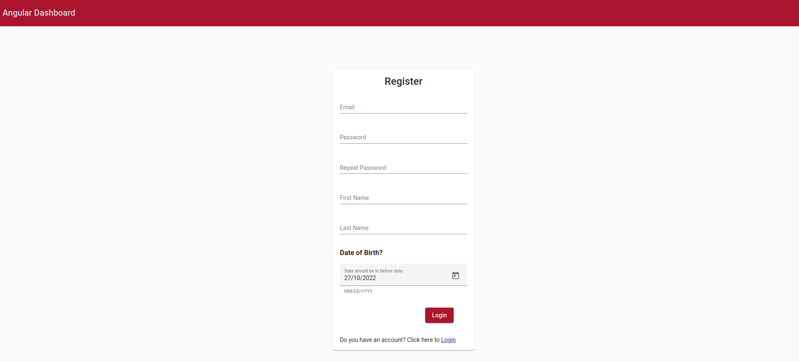
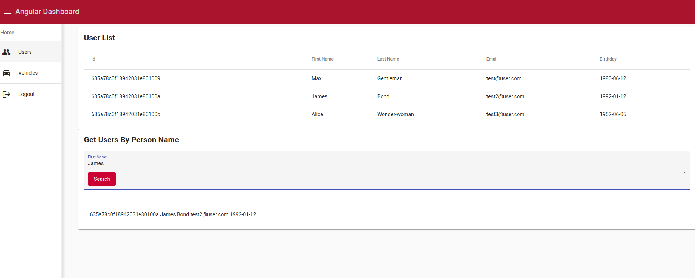
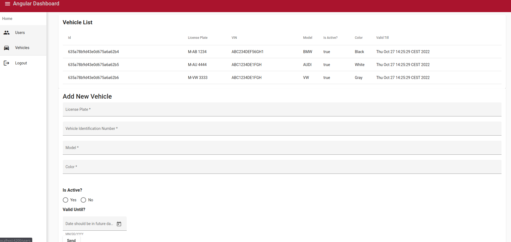

# angular-spring-k8s-concept
A concept repository which has a complete full stack application using microservices
## Structure
This Repository consist of Spring-Boot Microservices and an Angular Frontend

Every Micro service (Car-Micro-Api, Authentication-Service and User-Micro-Api) will register into the Eureka server and Eureka server knows all the client applications running on each port and IP address. Eureka Server is also known as Discovery Server.

Spring Cloud Gateway is intended to sit between a requester (Angular Frontend) and a resource (APIs) that’s being requested, where it intercepts, analyzes, and modifies every request. That means you can route requests based on their context.

That's why, Angular Frontend is communicating only with Gateway, which has the all the routes and
JWT Filtering.

Authentication-Service is small microservice which is communicating with User-micro-Api to register and login users

Car-Micro-Api and User-Micro-Api are nested APIs which is running on a random port and is used to redirect requests to micro-servers

Car-Micro-Api and Car-Micro-Server communicating over Kafka which is used as Messaging Queue in order to show that these microservices can also work asynchronously (It can be also replaced by RabbitMQ or any other technology)

Car-Micro-Server and User-Micro-Server is running the on specific port is which is only connection point of our MongoDB databases which makes this structure very secure.

All the information is stored in MongoDB as two different collections.

All Microservices are dockerized and ready to be deployed as docker-compose file.

## Frontend

When you run the frontend, you are going to see this screen. You can use these credentials to check that project is running.

`email:test@user.com password:test`

In registration page, you can create your own user as well.

After the successful registration you can see the users list which are populated as test data also you can get users by persons name as well

You can see the vehicle list and also create new vehicle within the form

## Run the project
Project is intended to work as dockerized, but it is developed flexible architecture, so if you have local MongoDB and Kafka instances you can run the project also locally.

You can change this configuration at `env` data which is in all projects.

### Dockerized

All you need is install [Docker and Docker Compose](https://docs.docker.com/compose/install/) and

`docker-compose up`

### Locally
If you have installed [MongoDB](https://www.mongodb.com/docs/manual/installation/) and [Kafka](https://kafka.apache.org/quickstart) locally, you can use localhost as well. 

You can run angular frontend as first installing dependencies `npm install` and then `ng serve`

To run Java Spring Boot microservices, you need to install [Gradle](https://docs.gradle.org/current/userguide/installation.html) and [Maven](https://maven.apache.org/install.html).

To Build Maven Microservices : [Link](https://maven.apache.org/guides/getting-started/maven-in-five-minutes.html)
To Build Gradle Microservices : [Gradle](https://docs.gradle.org/current/userguide/command_line_interface.html)

In Order to Register All Microservices in Eureka and Access them through Gateway, you need to run microservices in following order.

Order of running microservices: 

 Eureka-Registry Micro Service

... Other Micro Services (it does not matter which one you run)

 Gateway Micro Service

